# Friday Test Analysis Platform - Architectural Overview

## Executive Summary

The Friday Test Analysis Platform is an intelligent test results analysis system that transforms Cucumber test reports into actionable insights through AI-powered analysis, semantic search, and comprehensive analytics. The platform leverages modern microservices architecture, vector databases, and LLM integration to provide development teams with unprecedented visibility into their testing processes.

## High-Level System Architecture

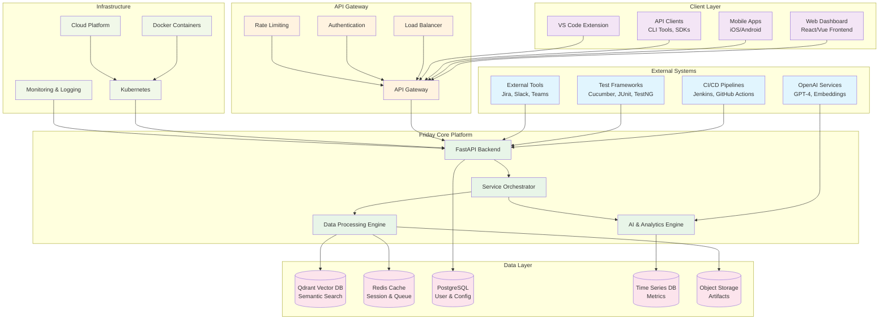

## Core Components Deep Dive

### 1. Data Processing Pipeline

The heart of Friday's architecture is its intelligent data processing pipeline that transforms raw test data into searchable, analyzable insights.

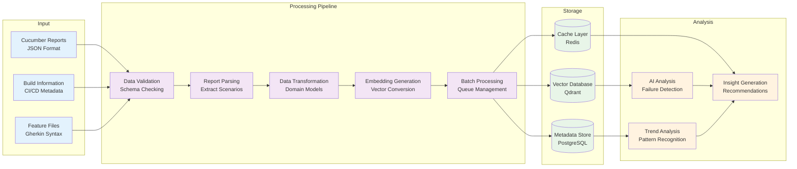

### 2. API Architecture & Endpoints

Friday exposes a comprehensive REST API with WebSocket support for real-time updates.

```mermaid
graph TD
    subgraph "API Endpoints"
        PROC_EP["/processor/*<br/>Data Ingestion"]
        SEARCH_EP["/search<br/>Semantic Search"]
        STATS_EP["/stats/*<br/>Analytics"]
        ANALYSIS_EP["/analysis/*<br/>AI Insights"]
        REPORTS_EP["/reports/*<br/>Reporting"]
        HEALTH_EP["/health<br/>System Status"]
    end
    
    subgraph "WebSocket Endpoints"
        WS_DASH["/ws/dashboard<br/>Real-time Updates"]
        WS_NOTIF["/ws/notifications<br/>Alerts"]
    end
    
    subgraph "Core Services"
        INGEST[Report Ingestion Service]
        SEARCH_SVC[Semantic Search Service]
        ANALYTICS[Analytics Service]
        AI_SVC[AI Analysis Service]
        REPORT_SVC[Reporting Service]
        HEALTH_SVC[Health Check Service]
    end
    
    subgraph "Real-time Services"
        STREAM[Event Streaming]
        NOTIF[Notification Service]
    end
    
    PROC_EP --> INGEST
    SEARCH_EP --> SEARCH_SVC
    STATS_EP --> ANALYTICS
    ANALYSIS_EP --> AI_SVC
    REPORTS_EP --> REPORT_SVC
    HEALTH_EP --> HEALTH_SVC
    
    WS_DASH --> STREAM
    WS_NOTIF --> NOTIF
    
    classDef endpoint fill:#e1f5fe
    classDef websocket fill:#f3e5f5
    classDef service fill:#e8f5e8
    classDef realtime fill:#fff3e0
    
    class PROC_EP,SEARCH_EP,STATS_EP,ANALYSIS_EP,REPORTS_EP,HEALTH_EP endpoint
    class WS_DASH,WS_NOTIF websocket
    class INGEST,SEARCH_SVC,ANALYTICS,AI_SVC,REPORT_SVC,HEALTH_SVC service
    class STREAM,NOTIF realtime
```

### 3. Vector Database & Semantic Search Architecture

The semantic search capability is powered by Qdrant vector database with AI-generated embeddings.

```mermaid
graph TB
    subgraph "Query Processing"
        USER_Q[User Query<br/>"login failures staging"]
        EMBED_Q[Query Embedding<br/>Vector Generation]
        FILTER[Filter Application<br/>Environment, Date, Status]
    end
    
    subgraph "Qdrant Collections"
        ARTIFACTS[test_artifacts<br/>Scenarios, Steps, Features]
        BUILDS[build_info<br/>CI/CD Metadata]
        CHUNKS[text_chunks<br/>Document Fragments]
    end
    
    subgraph "Search Processing"
        VECTOR_SEARCH[Vector Similarity<br/>Cosine Distance]
        RANKING[Result Ranking<br/>Relevance Scoring]
        HIGHLIGHT[Result Highlighting<br/>Context Extraction]
    end
    
    subgraph "AI Enhancement"
        CONTEXT[Context Analysis<br/>LLM Processing]
        INSIGHTS[Search Insights<br/>Related Patterns]
        SUGGEST[Query Suggestions<br/>Auto-complete]
    end
    
    USER_Q --> EMBED_Q
    EMBED_Q --> FILTER
    
    FILTER --> ARTIFACTS
    FILTER --> BUILDS
    FILTER --> CHUNKS
    
    ARTIFACTS --> VECTOR_SEARCH
    BUILDS --> VECTOR_SEARCH
    CHUNKS --> VECTOR_SEARCH
    
    VECTOR_SEARCH --> RANKING
    RANKING --> HIGHLIGHT
    
    HIGHLIGHT --> CONTEXT
    CONTEXT --> INSIGHTS
    INSIGHTS --> SUGGEST
    
    classDef query fill:#e3f2fd
    classDef collection fill:#f3e5f5
    classDef search fill:#e8f5e8
    classDef ai fill:#fff3e0
    
    class USER_Q,EMBED_Q,FILTER query
    class ARTIFACTS,BUILDS,CHUNKS collection
    class VECTOR_SEARCH,RANKING,HIGHLIGHT search
    class CONTEXT,INSIGHTS,SUGGEST ai
```

### 4. AI & Analytics Engine

The AI engine provides intelligent analysis and insights generation using OpenAI's GPT models.

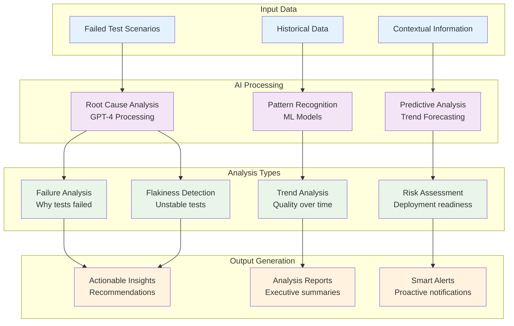

## Data Flow Architecture

### Complete Data Journey

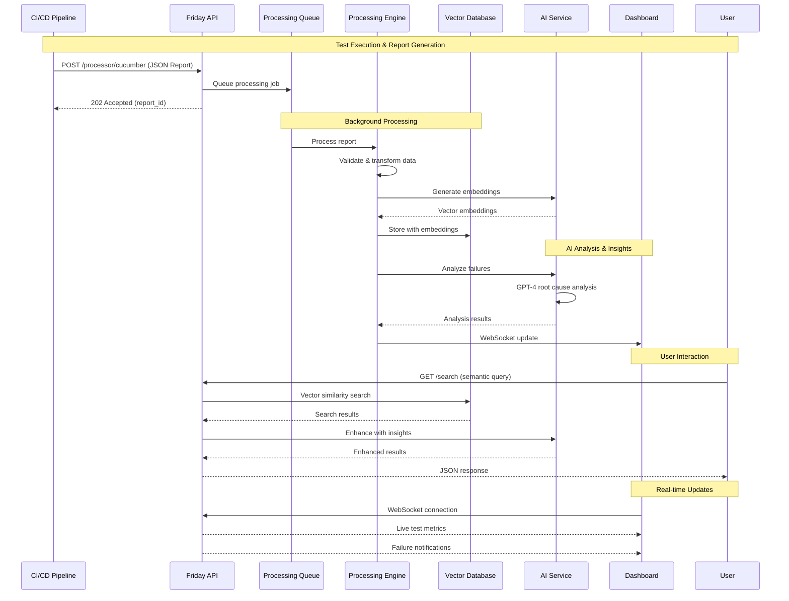

### Service Orchestration Flow

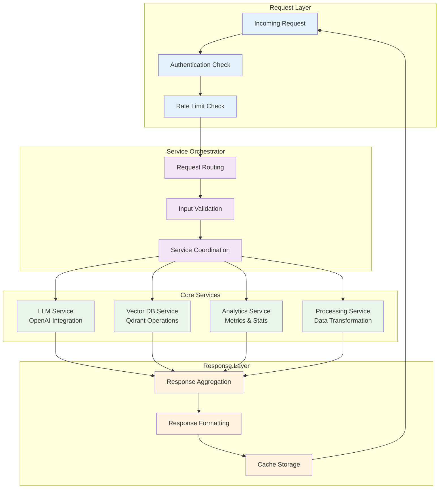

## Technology Stack & Infrastructure

### Technology Stack Overview

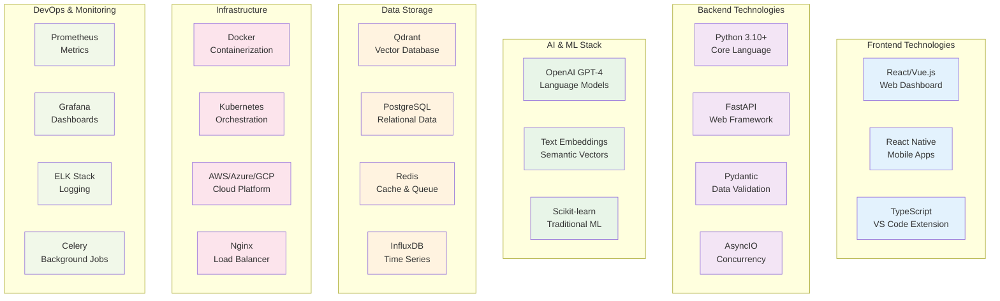

### Deployment Architecture

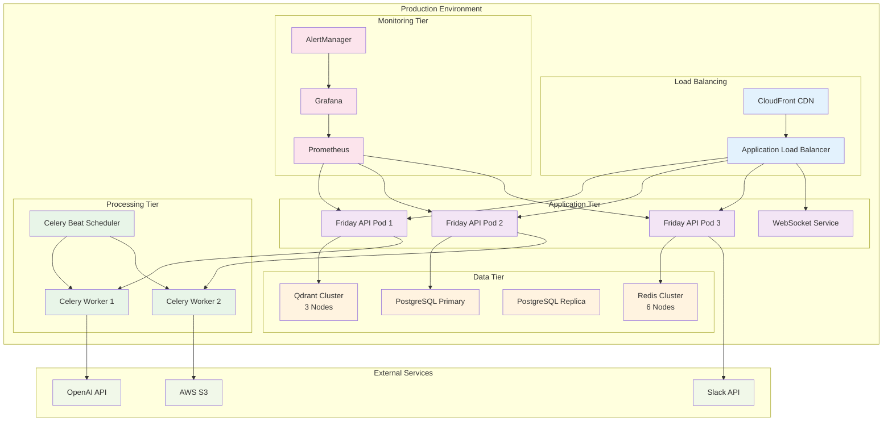

## Security Architecture

### Security Layers & Controls

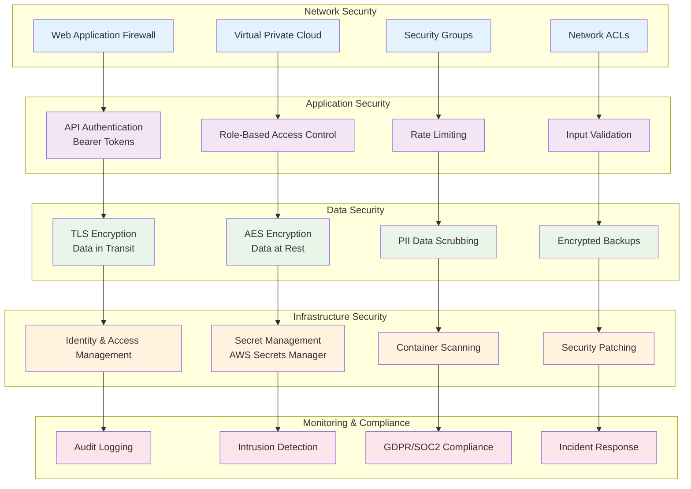

## Performance & Scalability

### Performance Characteristics

| Component | Expected Performance | Scalability Pattern |
|-----------|---------------------|-------------------|
| **API Endpoints** | < 100ms response time | Horizontal scaling with load balancing |
| **Semantic Search** | < 500ms query time | Vector database clustering |
| **AI Analysis** | 30-60 seconds | Async processing with queues |
| **Report Processing** | 2-3 minutes | Background workers with auto-scaling |
| **Real-time Updates** | < 50ms WebSocket latency | Connection pooling and clustering |
| **Dashboard Load** | < 2 seconds full page | CDN caching and lazy loading |

### Scaling Strategy

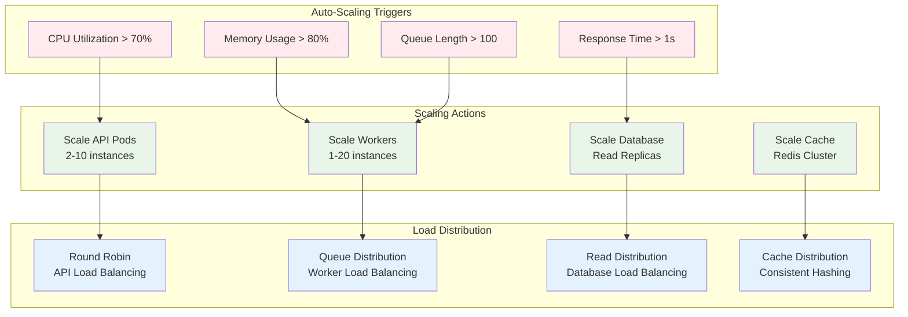

## Integration Patterns

### CI/CD Integration Flow

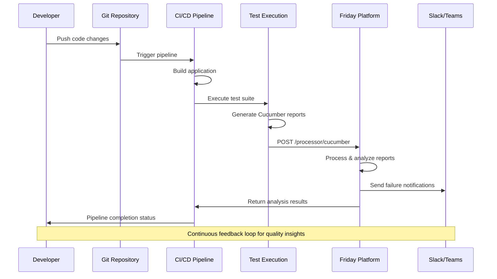

### Multi-Framework Support

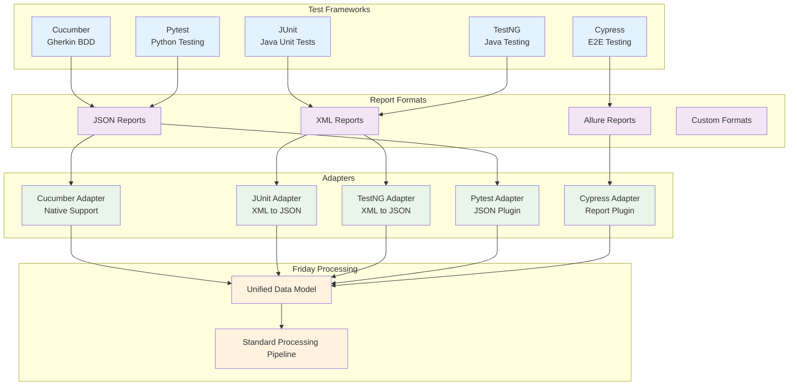

## Future Roadmap & Extensions

### Platform Evolution

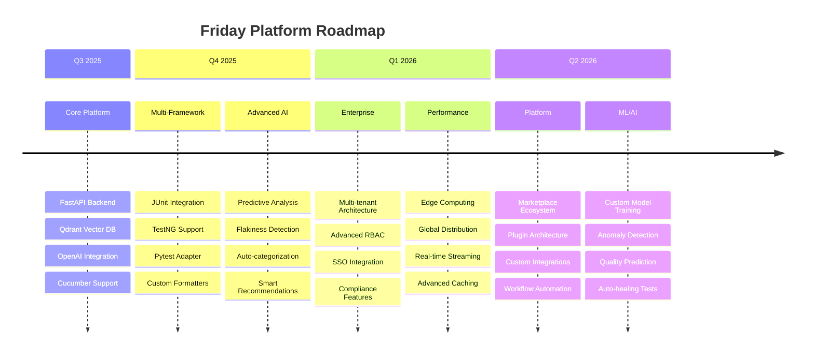

## Conclusion

The Friday Test Analysis Platform represents a modern, scalable architecture designed to transform how development teams analyze and act on test results. By combining vector databases for semantic search, AI/LLM services for intelligent analysis, and a robust microservices architecture, Friday provides unprecedented insights into testing processes.

**Key Architectural Strengths:**

- **Scalable Design**: Microservices architecture with auto-scaling capabilities
- **Intelligent Analysis**: AI-powered insights and semantic search
- **Real-time Capabilities**: WebSocket integration for live updates
- **Extensible Framework**: Plugin architecture for custom integrations
- **Enterprise Ready**: Security, monitoring, and compliance features
- **Performance Optimized**: Caching, async processing, and load balancing

**Technology Decisions:**

- **FastAPI**: High-performance async web framework
- **Qdrant**: Vector database for semantic search capabilities
- **OpenAI**: Industry-leading LLM for intelligent analysis
- **Kubernetes**: Container orchestration for scalability
- **Redis**: High-performance caching and queue management

This architectural foundation positions Friday to evolve with changing technology landscapes while maintaining reliability, performance, and extensibility for development teams of all sizes.