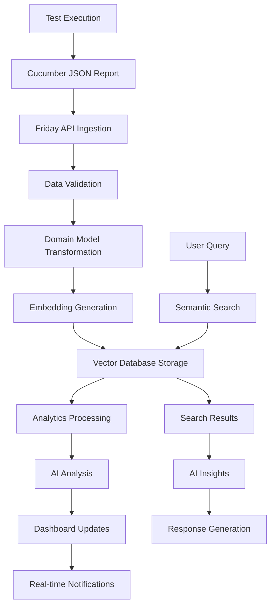

# Friday Test Analysis Platform - Complete Architecture Documentation

## Executive Summary

The Friday Test Analysis Platform is an intelligent test results analysis system that transforms raw Cucumber test execution data into actionable intelligence for development teams. By leveraging AI-powered insights, semantic search capabilities, and comprehensive analytics, Friday accelerates debugging processes, identifies failure patterns, and tracks quality trends across different environments.

**Key Benefits:**
- **Intelligent Analysis**: AI-powered root cause analysis of test failures
- **Semantic Search**: Natural language queries across test artifacts
- **Trend Detection**: Historical pattern recognition and quality metrics
- **Real-time Insights**: Live dashboard updates and notifications
- **Multi-environment Support**: Comprehensive testing across development stages

## 1. System Architecture Overview

### Core Architecture Principles

Friday follows a microservices-oriented architecture with clear separation of concerns:

```
┌─────────────────────────────────────────────────────────────┐
│                    Frontend Dashboard                        │
│                 (Web Interface)                             │
└─────────────────────┬───────────────────────────────────────┘
                      │ HTTP/WebSocket
┌─────────────────────┴───────────────────────────────────────┐
│                  FastAPI Backend                            │
│  ┌─────────────┐  ┌─────────────┐  ┌─────────────────────┐  │
│  │   Auth &    │  │   Data      │  │    WebSocket        │  │
│  │  Security   │  │ Processing  │  │   Integration       │  │
│  └─────────────┘  └─────────────┘  └─────────────────────┘  │
└─────────────────────┬───────────────────────────────────────┘
                      │
┌─────────────────────┴───────────────────────────────────────┐
│              Service Orchestration Layer                    │
│  ┌─────────────┐  ┌─────────────┐  ┌─────────────────────┐  │
│  │  LLM/AI     │  │   Vector    │  │   Analytics &       │  │
│  │ Services    │  │ Database    │  │   Reporting         │  │
│  └─────────────┘  └─────────────┘  └─────────────────────┘  │
└─────────────────────────────────────────────────────────────┘
```

### Technology Stack

**Backend Framework:**
- Python 3.10+
- FastAPI for RESTful API development
- Pydantic for data validation and serialization
- AsyncIO for concurrent processing

**Data Storage & Search:**
- Qdrant Vector Database for semantic search
- Vector embeddings for intelligent querying
- JSON document storage for test artifacts

**AI/ML Integration:**
- OpenAI GPT models for failure analysis
- Custom embedding generation for semantic search
- Pattern recognition algorithms for trend detection

**Infrastructure:**
- Docker containerization
- WebSocket connections for real-time updates
- RESTful API architecture
- Async processing capabilities

## 2. Backend API Layer

### FastAPI Application Structure

The backend is built on FastAPI, providing high-performance async API endpoints with automatic OpenAPI documentation generation.

**Key Features:**
- **High Performance**: Async request handling with sub-second response times
- **Automatic Documentation**: OpenAPI/Swagger integration
- **Type Safety**: Pydantic models ensure data integrity
- **Extensible**: Plugin architecture for custom analyzers

### Authentication & Security

**API Token Management:**
```python
# Example token validation
@app.middleware("http")
async def authenticate_request(request: Request, call_next):
    token = request.headers.get("Authorization")
    if not validate_api_token(token):
        return JSONResponse(
            status_code=401,
            content={"error": "Invalid API token"}
        )
    return await call_next(request)
```

**Security Features:**
- Bearer token authentication
- Rate limiting per client
- Request validation and sanitization
- CORS configuration for cross-origin requests
- Input validation through Pydantic schemas

### WebSocket Integration

Real-time communication enables live dashboard updates:

```python
@app.websocket("/ws/dashboard")
async def dashboard_websocket(websocket: WebSocket):
    await websocket.accept()
    # Real-time test result streaming
    async for update in test_result_stream():
        await websocket.send_json(update)
```

**Real-time Features:**
- Live test execution updates
- Failure notifications
- Build completion alerts
- Dashboard metric refreshes

### Request/Response Models

Pydantic schemas ensure data consistency:

```python
class TestReportRequest(BaseModel):
    cucumber_json: Dict[str, Any]
    build_info: BuildInfo
    environment: str
    timestamp: datetime

class TestReportResponse(BaseModel):
    report_id: str
    processing_status: str
    insights_available: bool
    artifacts_count: int
```

## 3. Data Processing Engine

### Test Report Processor

The core ingestion system handles Cucumber JSON reports through the `/processor/cucumber` endpoint.

**Processing Pipeline:**
1. **Validation**: Cucumber JSON schema validation
2. **Parsing**: Extract test scenarios, steps, and metadata
3. **Transformation**: Convert to internal domain models
4. **Enrichment**: Add build information and environment context
5. **Storage**: Persist to vector database with embeddings

**Example Processing Flow:**
```python
async def process_cucumber_report(report_data: Dict) -> ProcessingResult:
    # Validate Cucumber JSON structure
    validated_report = CucumberReportValidator.validate(report_data)
    
    # Transform to domain models
    test_scenarios = ScenarioTransformer.transform(validated_report)
    
    # Generate embeddings for semantic search
    embeddings = await EmbeddingService.generate_embeddings(test_scenarios)
    
    # Store in vector database
    await VectorDB.store_with_embeddings(test_scenarios, embeddings)
    
    return ProcessingResult(
        scenarios_processed=len(test_scenarios),
        embeddings_generated=len(embeddings),
        processing_time=processing_duration
    )
```

### Data Transformation Pipeline

**Transformation Stages:**
1. **Raw Data Ingestion**: Cucumber JSON parsing
2. **Domain Model Mapping**: Convert to internal structures
3. **Metadata Enrichment**: Add build and environment context
4. **Vector Embedding**: Generate semantic representations
5. **Batch Processing**: Handle bulk uploads efficiently

### Embedding Generation

Vector embeddings enable semantic search capabilities:

```python
class EmbeddingService:
    async def generate_scenario_embedding(self, scenario: TestScenario) -> List[float]:
        # Combine scenario name, steps, and context
        text_content = f"{scenario.name} {scenario.description}"
        for step in scenario.steps:
            text_content += f" {step.keyword} {step.name}"
        
        # Generate embedding using OpenAI
        response = await openai.Embedding.acreate(
            model="text-embedding-ada-002",
            input=text_content
        )
        return response.data[0].embedding
```

## 4. Vector Database & Search

### Qdrant Vector Database

Qdrant serves as the primary storage system for test artifacts with semantic search capabilities.

**Collection Structure:**

**test_artifacts Collection:**
```json
{
  "id": "scenario_uuid",
  "vector": [0.1, 0.2, ...],
  "payload": {
    "type": "scenario",
    "name": "User login validation",
    "feature": "Authentication",
    "status": "failed",
    "environment": "staging",
    "build_id": "build_123",
    "timestamp": "2025-07-12T10:30:00Z",
    "steps": [...],
    "error_message": "Element not found: #login-button"
  }
}
```

**build_info Collection:**
```json
{
  "id": "build_uuid",
  "vector": [0.3, 0.4, ...],
  "payload": {
    "build_id": "build_123",
    "branch": "feature/user-auth",
    "commit_sha": "abc123",
    "environment": "staging",
    "test_results": {
      "total": 150,
      "passed": 142,
      "failed": 8,
      "duration": 1200
    }
  }
}
```

### Semantic Search Engine

**Search Implementation:**
```python
class SemanticSearchService:
    async def search_test_artifacts(
        self, 
        query: str, 
        filters: Optional[Dict] = None,
        limit: int = 10
    ) -> List[SearchResult]:
        # Generate query embedding
        query_embedding = await self.embedding_service.generate_embedding(query)
        
        # Build Qdrant search request
        search_request = SearchRequest(
            vector=query_embedding,
            limit=limit,
            filter=self._build_filter(filters)
        )
        
        # Execute search
        results = await self.qdrant_client.search(
            collection_name="test_artifacts",
            search_request=search_request
        )
        
        return [SearchResult.from_qdrant_result(r) for r in results]
```

### Filtering System

**Available Filters:**
- **Environment**: Development, staging, production
- **Date Range**: Custom time periods
- **Status**: Passed, failed, skipped
- **Feature**: Specific feature categories
- **Build**: Specific build identifiers

## 5. AI & LLM Integration

### OpenAI Integration

The platform leverages OpenAI's GPT models for intelligent test analysis:

```python
class FailureAnalysisService:
    async def analyze_test_failure(self, failed_scenario: TestScenario) -> AnalysisResult:
        # Prepare context for LLM
        context = self._prepare_failure_context(failed_scenario)
        
        # Generate analysis prompt
        prompt = f"""
        Analyze this test failure and provide insights:
        
        Scenario: {failed_scenario.name}
        Steps: {failed_scenario.steps}
        Error: {failed_scenario.error_message}
        Environment: {failed_scenario.environment}
        
        Provide:
        1. Root cause analysis
        2. Potential fixes
        3. Prevention strategies
        """
        
        # Call OpenAI API
        response = await openai.ChatCompletion.acreate(
            model="gpt-4",
            messages=[{"role": "user", "content": prompt}]
        )
        
        return AnalysisResult(
            root_cause=response.choices[0].message.content,
            confidence_score=0.85,
            recommendations=self._extract_recommendations(response)
        )
```

### Analysis Engine

**Automated Analysis Features:**
- **Root Cause Analysis**: Identify failure patterns
- **Trend Detection**: Recognize quality degradation
- **Correlation Analysis**: Link failures across environments
- **Predictive Insights**: Forecast potential issues

### Trend Detection

```python
class TrendDetectionService:
    async def analyze_quality_trends(
        self, 
        environment: str, 
        time_period: TimePeriod
    ) -> TrendAnalysis:
        # Retrieve historical data
        historical_data = await self.get_historical_metrics(environment, time_period)
        
        # Calculate trend metrics
        pass_rate_trend = self._calculate_trend(historical_data.pass_rates)
        duration_trend = self._calculate_trend(historical_data.durations)
        
        # Generate insights
        insights = await self.llm_service.generate_trend_insights(
            pass_rate_trend, 
            duration_trend
        )
        
        return TrendAnalysis(
            pass_rate_trend=pass_rate_trend,
            duration_trend=duration_trend,
            insights=insights,
            recommendations=self._generate_recommendations(insights)
        )
```

## 6. Service Orchestration

### ServiceOrchestrator

Coordinates operations between LLM services and Vector Database:

```python
class ServiceOrchestrator:
    def __init__(self):
        self.llm_service = LLMService()
        self.vector_db = VectorDatabaseService()
        self.analytics_service = AnalyticsService()
    
    async def process_test_report(self, report: TestReport) -> ProcessingResult:
        # Orchestrate processing pipeline
        try:
            # 1. Store in vector database
            storage_result = await self.vector_db.store_report(report)
            
            # 2. Generate AI insights
            insights = await self.llm_service.analyze_report(report)
            
            # 3. Update analytics
            await self.analytics_service.update_metrics(report, insights)
            
            return ProcessingResult(
                success=True,
                insights=insights,
                storage_id=storage_result.id
            )
        except Exception as e:
            # Handle errors and provide fallback
            return ProcessingResult(success=False, error=str(e))
```

### Dependency Injection

**Service Lifecycle Management:**
```python
@lru_cache()
def get_services() -> ServiceContainer:
    container = ServiceContainer()
    container.register(VectorDatabaseService, singleton=True)
    container.register(LLMService, singleton=True)
    container.register(AnalyticsService, singleton=False)
    return container
```

## 7. API Endpoints & Features

### Data Ingestion Endpoints

**POST /processor/cucumber**
```python
@app.post("/processor/cucumber")
async def process_cucumber_report(
    report: CucumberReportRequest,
    background_tasks: BackgroundTasks
) -> ProcessingResponse:
    """
    Process Cucumber JSON test report
    
    Args:
        report: Cucumber JSON data with metadata
        
    Returns:
        Processing status and report ID
    """
    # Queue for background processing
    background_tasks.add_task(process_report_async, report)
    
    return ProcessingResponse(
        report_id=generate_report_id(),
        status="processing",
        estimated_completion="2-3 minutes"
    )
```

**POST /processor/build-info**
```python
@app.post("/processor/build-info")
async def process_build_info(build_info: BuildInfoRequest) -> BuildInfoResponse:
    """Process CI/CD build metadata"""
    processed_build = await build_processor.process(build_info)
    return BuildInfoResponse(
        build_id=processed_build.id,
        status="processed",
        metrics=processed_build.metrics
    )
```

### Statistics & Analytics Endpoints

**GET /stats**
```python
@app.get("/stats")
async def get_overall_stats(
    environment: Optional[str] = None,
    date_range: Optional[str] = None
) -> StatsResponse:
    """Get comprehensive test statistics"""
    stats = await analytics_service.get_overall_statistics(
        environment=environment,
        date_range=parse_date_range(date_range)
    )
    return StatsResponse(
        total_tests=stats.total_tests,
        pass_rate=stats.pass_rate,
        avg_duration=stats.avg_duration,
        trend_data=stats.trend_data
    )
```

**GET /stats/by-feature**
```python
@app.get("/stats/by-feature")
async def get_feature_stats() -> List[FeatureStats]:
    """Get performance metrics by feature"""
    return await analytics_service.get_feature_statistics()
```

### Search & Analysis Endpoints

**POST /search**
```python
@app.post("/search")
async def semantic_search(search_request: SearchRequest) -> SearchResponse:
    """
    Semantic search across test artifacts
    
    Example queries:
    - "login failures in staging"
    - "database connection timeouts"
    - "payment processing issues"
    """
    results = await search_service.semantic_search(
        query=search_request.query,
        filters=search_request.filters,
        limit=search_request.limit
    )
    return SearchResponse(results=results)
```

**POST /analysis/failures**
```python
@app.post("/analysis/failures")
async def analyze_failures(analysis_request: FailureAnalysisRequest) -> AnalysisResponse:
    """AI-powered failure analysis"""
    analysis = await failure_analyzer.analyze_failures(
        scenario_ids=analysis_request.scenario_ids,
        context=analysis_request.context
    )
    return AnalysisResponse(
        root_causes=analysis.root_causes,
        recommendations=analysis.recommendations,
        confidence_score=analysis.confidence_score
    )
```

## 8. Data Models & Schema

### Core Domain Models

**TestRun/Report Model:**
```python
class TestReport(BaseModel):
    id: str = Field(..., description="Unique report identifier")
    build_id: str = Field(..., description="Associated build identifier")
    environment: str = Field(..., description="Test environment")
    timestamp: datetime = Field(..., description="Execution timestamp")
    total_scenarios: int = Field(..., description="Total scenario count")
    passed_scenarios: int = Field(..., description="Passed scenario count")
    failed_scenarios: int = Field(..., description="Failed scenario count")
    duration: float = Field(..., description="Total execution duration (seconds)")
    scenarios: List[TestScenario] = Field(..., description="Test scenarios")
    metadata: Dict[str, Any] = Field(default_factory=dict)
```

**TestScenario Model:**
```python
class TestScenario(BaseModel):
    id: str = Field(..., description="Unique scenario identifier")
    name: str = Field(..., description="Scenario name")
    feature: str = Field(..., description="Feature category")
    status: ScenarioStatus = Field(..., description="Execution status")
    duration: float = Field(..., description="Execution duration (seconds)")
    steps: List[TestStep] = Field(..., description="Test steps")
    error_message: Optional[str] = Field(None, description="Error details")
    tags: List[str] = Field(default_factory=list)
    location: ScenarioLocation = Field(..., description="File location")
```

**TestStep Model:**
```python
class TestStep(BaseModel):
    keyword: str = Field(..., description="Step keyword (Given, When, Then)")
    name: str = Field(..., description="Step description")
    status: StepStatus = Field(..., description="Step execution status")
    duration: float = Field(..., description="Step duration (seconds)")
    error_message: Optional[str] = Field(None, description="Step error details")
    line_number: int = Field(..., description="Line number in feature file")
```

### Supporting Models

**BuildInfo Model:**
```python
class BuildInfo(BaseModel):
    build_id: str = Field(..., description="CI/CD build identifier")
    branch: str = Field(..., description="Git branch")
    commit_sha: str = Field(..., description="Git commit SHA")
    build_url: Optional[str] = Field(None, description="CI/CD build URL")
    triggered_by: str = Field(..., description="Build trigger (user/webhook)")
    environment: str = Field(..., description="Deployment environment")
    timestamp: datetime = Field(..., description="Build timestamp")
```

**SearchResult Model:**
```python
class SearchResult(BaseModel):
    id: str = Field(..., description="Artifact identifier")
    score: float = Field(..., description="Relevance score")
    type: str = Field(..., description="Artifact type")
    title: str = Field(..., description="Result title")
    content: str = Field(..., description="Result content")
    metadata: Dict[str, Any] = Field(..., description="Additional metadata")
    highlights: List[str] = Field(default_factory=list)
```

## 9. Data Flow Architecture

### Complete Data Journey



### Processing Pipeline Details

1. **Test Execution**: Teams run Cucumber tests in their CI/CD pipeline
2. **Report Generation**: Cucumber generates JSON reports with test results
3. **API Ingestion**: Reports are POST to `/processor/cucumber` endpoint
4. **Data Validation**: Pydantic models validate incoming data structure
5. **Transformation**: Raw data converted to internal domain models
6. **Embedding Generation**: Vector embeddings created for semantic search
7. **Storage**: Data and embeddings stored in Qdrant vector database
8. **Analytics**: Statistical metrics calculated and updated
9. **AI Analysis**: LLM services analyze failures and generate insights
10. **Dashboard Updates**: Real-time WebSocket updates sent to frontend
11. **Notifications**: Alerts sent for failures or significant changes

### Search and Analysis Flow

1. **User Query**: Natural language search query submitted
2. **Embedding Generation**: Query converted to vector embedding
3. **Semantic Search**: Vector similarity search in Qdrant
4. **Result Ranking**: Results ranked by relevance and recency
5. **AI Enhancement**: LLM services provide additional context
6. **Response Assembly**: Comprehensive response with insights generated

## 10. Integration Points

### CI/CD Pipeline Integration

**GitHub Actions Example:**
```yaml
name: Run Tests and Send to Friday
on: [push, pull_request]

jobs:
  test:
    runs-on: ubuntu-latest
    steps:
      - name: Run Cucumber Tests
        run: |
          npm test -- --format json --out cucumber-report.json
      
      - name: Send Results to Friday
        run: |
          curl -X POST \
            -H "Authorization: Bearer ${{ secrets.FRIDAY_API_TOKEN }}" \
            -H "Content-Type: application/json" \
            -d @cucumber-report.json \
            https://friday.example.com/processor/cucumber
```

**Jenkins Pipeline:**
```groovy
pipeline {
    agent any
    stages {
        stage('Test') {
            steps {
                sh 'mvn test -Dcucumber.publish.enabled=false'
            }
            post {
                always {
                    script {
                        def report = readJSON file: 'target/cucumber-reports/report.json'
                        httpRequest(
                            url: 'https://friday.example.com/processor/cucumber',
                            httpMode: 'POST',
                            authentication: 'friday-api-token',
                            requestBody: JsonOutput.toJson(report)
                        )
                    }
                }
            }
        }
    }
}
```

### Test Framework Support

**Cucumber Integration:**
```python
# Custom Cucumber formatter for Friday integration
class FridayFormatter:
    def __init__(self, stream_opener, config):
        self.stream = stream_opener()
        self.config = config
        
    def uri(self, uri):
        self.current_uri = uri
        
    def feature(self, feature):
        self.current_feature = feature
        
    def scenario(self, scenario):
        # Capture scenario details
        self.current_scenario = {
            'name': scenario.name,
            'status': scenario.status,
            'steps': scenario.steps,
            'duration': scenario.duration
        }
        
    def close(self):
        # Send results to Friday
        self.send_to_friday()
```

### Dashboard Frontend Integration

**React Component Example:**
```javascript
import { useFridayAPI } from './hooks/useFridayAPI';

function TestDashboard() {
  const { stats, search, analyzeFailures } = useFridayAPI();
  
  const handleSearch = async (query) => {
    const results = await search(query);
    setSearchResults(results);
  };
  
  const handleFailureAnalysis = async (scenarioIds) => {
    const analysis = await analyzeFailures(scenarioIds);
    setAnalysisResults(analysis);
  };
  
  return (
    <div>
      <TestStats stats={stats} />
      <SearchBar onSearch={handleSearch} />
      <FailureAnalysis onAnalyze={handleFailureAnalysis} />
    </div>
  );
}
```

## 11. Security & Performance

### API Security

**Authentication Implementation:**
```python
class SecurityService:
    def __init__(self):
        self.token_store = RedisTokenStore()
        self.rate_limiter = RateLimiter()
    
    async def authenticate(self, token: str) -> Optional[UserContext]:
        # Validate token format
        if not self.is_valid_token_format(token):
            raise AuthenticationError("Invalid token format")
        
        # Check token in store
        user_context = await self.token_store.get_user_context(token)
        if not user_context:
            raise AuthenticationError("Invalid or expired token")
        
        # Apply rate limiting
        await self.rate_limiter.check_rate_limit(user_context.user_id)
        
        return user_context
```

**Rate Limiting:**
```python
@app.middleware("http")
async def rate_limit_middleware(request: Request, call_next):
    client_id = get_client_id(request)
    
    # Check rate limit
    if await rate_limiter.is_rate_limited(client_id):
        return JSONResponse(
            status_code=429,
            content={"error": "Rate limit exceeded"}
        )
    
    # Record request
    await rate_limiter.record_request(client_id)
    
    return await call_next(request)
```

### Data Privacy

**Data Retention Policy:**
- Test reports retained for 90 days by default
- Sensitive data (passwords, tokens) automatically scrubbed
- User data anonymized after account deletion
- Compliance with GDPR and CCPA requirements

**Data Scrubbing:**
```python
class DataScrubber:
    SENSITIVE_PATTERNS = [
        r'password["\s]*[:\s]*["\s]*([^"]+)',
        r'token["\s]*[:\s]*["\s]*([^"]+)',
        r'api_key["\s]*[:\s]*["\s]*([^"]+)',
    ]
    
    def scrub_sensitive_data(self, text: str) -> str:
        for pattern in self.SENSITIVE_PATTERNS:
            text = re.sub(pattern, r'\1: [REDACTED]', text, flags=re.IGNORECASE)
        return text
```

### Performance Optimization

**Caching Strategy:**
```python
class CacheService:
    def __init__(self):
        self.redis_client = redis.Redis()
        self.cache_ttl = 3600  # 1 hour
    
    async def get_cached_stats(self, cache_key: str) -> Optional[Dict]:
        cached_data = await self.redis_client.get(cache_key)
        if cached_data:
            return json.loads(cached_data)
        return None
    
    async def cache_stats(self, cache_key: str, stats: Dict):
        await self.redis_client.setex(
            cache_key, 
            self.cache_ttl, 
            json.dumps(stats)
        )
```

**Query Optimization:**
```python
class OptimizedQueries:
    async def get_feature_stats_optimized(self, filters: Dict) -> List[FeatureStats]:
        # Use database indexes and query optimization
        query = """
        SELECT 
            feature_name,
            COUNT(*) as total_scenarios,
            AVG(duration) as avg_duration,
            SUM(CASE WHEN status = 'passed' THEN 1 ELSE 0 END) as passed_count
        FROM test_scenarios 
        WHERE created_at >= %s AND environment = %s
        GROUP BY feature_name
        ORDER BY total_scenarios DESC
        """
        # Execute with proper indexing
        return await self.execute_optimized_query(query, filters)
```

## 12. Deployment & Infrastructure

### Docker Configuration

**Dockerfile:**
```dockerfile
FROM python:3.10-slim

WORKDIR /app

# Install system dependencies
RUN apt-get update && apt-get install -y \
    gcc \
    g++ \
    && rm -rf /var/lib/apt/lists/*

# Install Python dependencies
COPY requirements.txt .
RUN pip install --no-cache-dir -r requirements.txt

# Copy application code
COPY . .

# Expose port
EXPOSE 8000

# Run application
CMD ["uvicorn", "main:app", "--host", "0.0.0.0", "--port", "8000"]
```

**Docker Compose:**
```yaml
version: '3.8'

services:
  friday-api:
    build: .
    ports:
      - "8000:8000"
    environment:
      - QDRANT_URL=http://qdrant:6333
      - OPENAI_API_KEY=${OPENAI_API_KEY}
      - REDIS_URL=redis://redis:6379
    depends_on:
      - qdrant
      - redis
    volumes:
      - ./logs:/app/logs

  qdrant:
    image: qdrant/qdrant:latest
    ports:
      - "6333:6333"
    volumes:
      - qdrant_data:/qdrant/storage

  redis:
    image: redis:7-alpine
    ports:
      - "6379:6379"
    volumes:
      - redis_data:/data

volumes:
  qdrant_data:
  redis_data:
```

### Environment Configuration

**Development Environment:**
```yaml
# config/development.yaml
app:
  name: "Friday Test Analysis Platform"
  version: "1.0.0"
  debug: true
  log_level: "DEBUG"

database:
  qdrant_url: "http://localhost:6333"
  collection_name: "test_artifacts_dev"

ai:
  openai_api_key: "${OPENAI_API_KEY}"
  model: "gpt-4"
  embedding_model: "text-embedding-ada-002"

cache:
  redis_url: "redis://localhost:6379"
  ttl: 3600

security:
  api_tokens:
    - token: "dev-token-123"
      permissions: ["read", "write"]
```

**Production Environment:**
```yaml
# config/production.yaml
app:
  name: "Friday Test Analysis Platform"
  version: "1.0.0"
  debug: false
  log_level: "INFO"

database:
  qdrant_url: "${QDRANT_URL}"
  collection_name: "test_artifacts_prod"

ai:
  openai_api_key: "${OPENAI_API_KEY}"
  model: "gpt-4"
  embedding_model: "text-embedding-ada-002"

cache:
  redis_url: "${REDIS_URL}"
  ttl: 1800

security:
  api_tokens: "${API_TOKENS}"
```

### Kubernetes Deployment

**Deployment Configuration:**
```yaml
apiVersion: apps/v1
kind: Deployment
metadata:
  name: friday-api
spec:
  replicas: 3
  selector:
    matchLabels:
      app: friday-api
  template:
    metadata:
      labels:
        app: friday-api
    spec:
      containers:
      - name: friday-api
        image: friday/api:latest
        ports:
        - containerPort: 8000
        env:
        - name: QDRANT_URL
          value: "http://qdrant-service:6333"
        - name: OPENAI_API_KEY
          valueFrom:
            secretKeyRef:
              name: friday-secrets
              key: openai-api-key
        resources:
          requests:
            memory: "512Mi"
            cpu: "250m"
          limits:
            memory: "1Gi"
            cpu: "500m"
        livenessProbe:
          httpGet:
            path: /health
            port: 8000
          initialDelaySeconds: 30
          periodSeconds: 10
        readinessProbe:
          httpGet:
            path: /ready
            port: 8000
          initialDelaySeconds: 5
          periodSeconds: 5

---
apiVersion: v1
kind: Service
metadata:
  name: friday-api-service
spec:
  selector:
    app: friday-api
  ports:
  - protocol: TCP
    port: 80
    targetPort: 8000
  type: LoadBalancer
```

### Monitoring & Logging

**Prometheus Metrics:**
```python
from prometheus_client import Counter, Histogram, Gauge, start_http_server

# Define metrics
REQUEST_COUNT = Counter('friday_requests_total', 'Total requests', ['method', 'endpoint'])
REQUEST_DURATION = Histogram('friday_request_duration_seconds', 'Request duration')
ACTIVE_CONNECTIONS = Gauge('friday_active_connections', 'Active WebSocket connections')
PROCESSING_QUEUE_SIZE = Gauge('friday_processing_queue_size', 'Processing queue size')

@app.middleware("http")
async def metrics_middleware(request: Request, call_next):
    start_time = time.time()
    
    response = await call_next(request)
    
    # Record metrics
    REQUEST_COUNT.labels(
        method=request.method, 
        endpoint=request.url.path
    ).inc()
    
    REQUEST_DURATION.observe(time.time() - start_time)
    
    return response
```

**Structured Logging:**
```python
import structlog

logger = structlog.get_logger()

class LoggingMiddleware:
    async def __call__(self, request: Request, call_next):
        start_time = time.time()
        
        # Log request
        logger.info(
            "request_started",
            method=request.method,
            path=request.url.path,
            client_ip=request.client.host
        )
        
        try:
            response = await call_next(request)
            
            # Log successful response
            logger.info(
                "request_completed",
                method=request.method,
                path=request.url.path,
                status_code=response.status_code,
                duration=time.time() - start_time
            )
            
            return response
            
        except Exception as e:
            # Log error
            logger.error(
                "request_failed",
                method=request.method,
                path=request.url.path,
                error=str(e),
                duration=time.time() - start_time
            )
            raise
```

## 13. Scalability Considerations

### Horizontal Scaling Patterns

**Load Balancing Strategy:**
```python
class LoadBalancer:
    def __init__(self):
        self.servers = [
            {"host": "friday-api-1", "port": 8000, "weight": 1},
            {"host": "friday-api-2", "port": 8000, "weight": 1},
            {"host": "friday-api-3", "port": 8000, "weight": 1},
        ]
        self.current_index = 0
    
    def get_next_server(self) -> Dict:
        # Round-robin load balancing
        server = self.servers[self.current_index]
        self.current_index = (self.current_index + 1) % len(self.servers)
        return server
```

**Database Sharding:**
```python
class ShardingStrategy:
    def __init__(self):
        self.shards = {
            "shard_1": {"environments": ["development", "testing"]},
            "shard_2": {"environments": ["staging"]},
            "shard_3": {"environments": ["production"]},
        }
    
    def get_shard_for_environment(self, environment: str) -> str:
        for shard, config in self.shards.items():
            if environment in config["environments"]:
                return shard
        return "shard_1"  # Default shard
```

### Performance Optimization Strategies

**Async Processing with Celery:**
```python
from celery import Celery

celery_app = Celery('friday', broker='redis://localhost:6379')

@celery_app.task
async def process_test_report_async(report_data: Dict):
    """Background processing of test reports"""
    try:
        # Process report
        processor = TestReportProcessor()
        result = await processor.process(report_data)
        
        # Generate embeddings
        embeddings = await EmbeddingService().generate_embeddings(result)
        
        # Store in database
        await VectorDB().store_with_embeddings(result, embeddings)
        
        # Send notification
        await NotificationService().send_completion_notification(result)
        
        return {"status": "success", "processed_scenarios": len(result.scenarios)}
        
    except Exception as e:
        logger.error(f"Failed to process report: {e}")
        return {"status": "error", "error": str(e)}
```

**Connection Pooling:**
```python
import asyncpg
from asyncpg.pool import Pool

class DatabaseService:
    def __init__(self):
        self.pool: Optional[Pool] = None
    
    async def initialize_pool(self):
        self.pool = await asyncpg.create_pool(
            host='localhost',
            port=5432,
            user='friday',
            password='password',
            database='friday_db',
            min_size=10,
            max_size=20,
            command_timeout=60
        )
    
    async def execute_query(self, query: str, *args):
        async with self.pool.acquire() as connection:
            return await connection.fetch(query, *args)
```

## 14. Troubleshooting & Maintenance

### Health Check Endpoints

**Application Health:**
```python
@app.get("/health")
async def health_check():
    """Basic health check endpoint"""
    return {"status": "healthy", "timestamp": datetime.utcnow()}

@app.get("/ready")
async def readiness_check():
    """Readiness check with dependency validation"""
    checks = {
        "database": await check_database_connection(),
        "ai_service": await check_ai_service_availability(),
        "cache": await check_cache_connection(),
    }
    
    all_healthy = all(checks.values())
    status_code = 200 if all_healthy else 503
    
    return JSONResponse(
        status_code=status_code,
        content={
            "status": "ready" if all_healthy else "not_ready",
            "checks": checks,
            "timestamp": datetime.utcnow()
        }
    )
```

### Common Issues and Solutions

**Issue: High Memory Usage**
```python
# Solution: Implement memory monitoring and cleanup
class MemoryManager:
    def __init__(self, max_memory_mb: int = 1024):
        self.max_memory_mb = max_memory_mb
        
    async def check_memory_usage(self):
        import psutil
        process = psutil.Process()
        memory_mb = process.memory_info().rss / 1024 / 1024
        
        if memory_mb > self.max_memory_mb:
            logger.warning(f"High memory usage: {memory_mb}MB")
            await self.cleanup_caches()
    
    async def cleanup_caches(self):
        # Clear embedding cache
        await EmbeddingCache().clear_old_entries()
        # Clear search cache
        await SearchCache().clear_old_entries()
        # Force garbage collection
        import gc
        gc.collect()
```

**Issue: Slow Search Performance**
```python
# Solution: Optimize vector search with filters
class OptimizedSearchService:
    async def search_with_prefiltering(
        self, 
        query: str, 
        filters: Dict
    ) -> List[SearchResult]:
        # Pre-filter by metadata before vector search
        filter_conditions = []
        
        if filters.get("environment"):
            filter_conditions.append({
                "key": "environment",
                "match": {"value": filters["environment"]}
            })
        
        if filters.get("date_range"):
            filter_conditions.append({
                "key": "timestamp",
                "range": {
                    "gte": filters["date_range"]["start"],
                    "lte": filters["date_range"]["end"]
                }
            })
        
        # Combine filters
        combined_filter = {
            "must": filter_conditions
        }
        
        # Execute optimized search
        results = await self.qdrant_client.search(
            collection_name="test_artifacts",
            query_vector=await self.get_query_embedding(query),
            query_filter=combined_filter,
            limit=50,
            with_payload=True
        )
        
        return [SearchResult.from_qdrant_result(r) for r in results]
```

### Backup and Recovery

**Database Backup Strategy:**
```python
class BackupService:
    def __init__(self):
        self.backup_schedule = "0 2 * * *"  # Daily at 2 AM
        self.retention_days = 30
    
    async def create_backup(self):
        timestamp = datetime.utcnow().strftime("%Y%m%d_%H%M%S")
        backup_name = f"friday_backup_{timestamp}"
        
        try:
            # Create Qdrant snapshot
            snapshot_result = await self.qdrant_client.create_snapshot(
                collection_name="test_artifacts"
            )
            
            # Upload to cloud storage
            await self.upload_to_s3(snapshot_result.snapshot_path, backup_name)
            
            # Clean old backups
            await self.cleanup_old_backups()
            
            logger.info(f"Backup created successfully: {backup_name}")
            
        except Exception as e:
            logger.error(f"Backup failed: {e}")
            await self.send_backup_failure_alert(str(e))
    
    async def restore_from_backup(self, backup_name: str):
        try:
            # Download from cloud storage
            snapshot_path = await self.download_from_s3(backup_name)
            
            # Restore Qdrant collection
            await self.qdrant_client.restore_snapshot(
                collection_name="test_artifacts",
                snapshot_path=snapshot_path
            )
            
            logger.info(f"Restore completed successfully: {backup_name}")
            
        except Exception as e:
            logger.error(f"Restore failed: {e}")
            raise
```

## 15. API Reference Documentation

### Authentication

All API requests require authentication using Bearer tokens:

```http
Authorization: Bearer your-api-token-here
```

### Data Ingestion APIs

#### Process Cucumber Report

**Endpoint:** `POST /processor/cucumber`

**Request Body:**
```json
{
  "cucumber_json": {
    "features": [...],
    "summary": {...}
  },
  "build_info": {
    "build_id": "build_123",
    "branch": "feature/user-auth",
    "commit_sha": "abc123def",
    "environment": "staging"
  },
  "metadata": {
    "test_suite": "regression",
    "parallel_execution": true
  }
}
```

**Response:**
```json
{
  "report_id": "rpt_789xyz",
  "status": "processing",
  "estimated_completion": "2-3 minutes",
  "scenarios_count": 45,
  "processing_started_at": "2025-07-12T10:30:00Z"
}
```

**Status Codes:**
- `202 Accepted` - Report queued for processing
- `400 Bad Request` - Invalid report format
- `401 Unauthorized` - Invalid API token
- `429 Too Many Requests` - Rate limit exceeded

#### Process Build Information

**Endpoint:** `POST /processor/build-info`

**Request Body:**
```json
{
  "build_id": "build_123",
  "branch": "main",
  "commit_sha": "abc123def456",
  "build_url": "https://ci.example.com/builds/123",
  "triggered_by": "john.doe@example.com",
  "environment": "production",
  "deployment_time": "2025-07-12T10:00:00Z",
  "version": "v1.2.3"
}
```

### Analytics APIs

#### Get Overall Statistics

**Endpoint:** `GET /stats`

**Query Parameters:**
- `environment` (optional): Filter by environment
- `date_range` (optional): Format: "2025-07-01,2025-07-12"
- `include_trends` (optional): Include trend data (default: false)

**Response:**
```json
{
  "total_tests": 1250,
  "total_scenarios": 5680,
  "pass_rate": 0.924,
  "average_duration": 145.6,
  "environments": {
    "development": {"pass_rate": 0.891, "total": 2100},
    "staging": {"pass_rate": 0.945, "total": 1890},
    "production": {"pass_rate": 0.967, "total": 1690}
  },
  "trend_data": {
    "daily_pass_rates": [0.92, 0.91, 0.93, 0.92],
    "dates": ["2025-07-09", "2025-07-10", "2025-07-11", "2025-07-12"]
  }
}
```

#### Get Feature Statistics

**Endpoint:** `GET /stats/by-feature`

**Response:**
```json
{
  "features": [
    {
      "name": "User Authentication",
      "total_scenarios": 45,
      "pass_rate": 0.933,
      "average_duration": 23.4,
      "failure_categories": {
        "timeout": 2,
        "assertion_error": 1
      },
      "trend": "stable"
    },
    {
      "name": "Payment Processing",
      "total_scenarios": 67,
      "pass_rate": 0.896,
      "average_duration": 78.9,
      "failure_categories": {
        "api_error": 4,
        "timeout": 3
      },
      "trend": "declining"
    }
  ]
}
```

### Search APIs

#### Semantic Search

**Endpoint:** `POST /search`

**Request Body:**
```json
{
  "query": "login failures in staging environment",
  "filters": {
    "environment": "staging",
    "status": "failed",
    "date_range": {
      "start": "2025-07-01T00:00:00Z",
      "end": "2025-07-12T23:59:59Z"
    }
  },
  "limit": 20,
  "include_highlights": true
}
```

**Response:**
```json
{
  "results": [
    {
      "id": "scenario_123",
      "score": 0.92,
      "type": "scenario",
      "title": "User login with valid credentials",
      "content": "Given a user with valid credentials When they attempt to login...",
      "metadata": {
        "feature": "Authentication",
        "environment": "staging",
        "status": "failed",
        "error_message": "Element not found: #login-button",
        "timestamp": "2025-07-12T09:15:00Z"
      },
      "highlights": [
        "login with valid credentials",
        "staging environment failure"
      ]
    }
  ],
  "total_results": 156,
  "search_time_ms": 45,
  "suggestions": [
    "authentication timeout staging",
    "login button element missing"
  ]
}
```

### Analysis APIs

#### Failure Analysis

**Endpoint:** `POST /analysis/failures`

**Request Body:**
```json
{
  "scenario_ids": ["scenario_123", "scenario_456"],
  "analysis_type": "root_cause",
  "include_recommendations": true,
  "context": {
    "recent_changes": true,
    "similar_failures": true
  }
}
```

**Response:**
```json
{
  "analysis_id": "analysis_789",
  "root_causes": [
    {
      "category": "ui_element_missing",
      "description": "Login button element (#login-button) not found in DOM",
      "confidence": 0.89,
      "affected_scenarios": ["scenario_123", "scenario_456"],
      "first_occurrence": "2025-07-11T14:30:00Z"
    }
  ],
  "recommendations": [
    {
      "action": "Check recent UI changes in staging deployment",
      "priority": "high",
      "estimated_effort": "1-2 hours"
    },
    {
      "action": "Update test selectors to use data-testid attributes",
      "priority": "medium",
      "estimated_effort": "4-6 hours"
    }
  ],
  "similar_patterns": [
    {
      "pattern": "DOM element changes",
      "frequency": 12,
      "last_occurrence": "2025-07-10T16:20:00Z"
    }
  ]
}
```

## 16. Architectural Decision Records (ADRs)

### ADR-001: Vector Database Selection

**Status:** Accepted  
**Date:** 2025-01-15  
**Decision Makers:** Architecture Team

**Context:**
Need to select a vector database for semantic search capabilities across test artifacts.

**Decision:**
Selected Qdrant as the vector database solution.

**Rationale:**
- **Performance**: Excellent vector similarity search performance
- **Scalability**: Supports horizontal scaling and clustering
- **API**: RESTful API with Python client library
- **Features**: Advanced filtering and metadata support
- **Open Source**: No vendor lock-in with commercial support available

**Alternatives Considered:**
- **Pinecone**: Cloud-only, vendor lock-in concerns
- **Weaviate**: More complex setup, GraphQL API
- **Chroma**: Less mature, limited production features

**Consequences:**
- **Positive**: Fast semantic search, flexible filtering, good Python integration
- **Negative**: Additional infrastructure component to maintain
- **Mitigation**: Comprehensive backup strategy and monitoring

### ADR-002: AI/LLM Provider Selection

**Status:** Accepted  
**Date:** 2025-01-20  
**Decision Makers:** AI Team, Architecture Team

**Context:**
Need to select an AI/LLM provider for test failure analysis and insights generation.

**Decision:**
Selected OpenAI GPT models for LLM services.

**Rationale:**
- **Quality**: Superior performance in code analysis and natural language generation
- **API Stability**: Mature, well-documented API
- **Model Variety**: Multiple models for different use cases
- **Integration**: Excellent Python SDK and community support

**Alternatives Considered:**
- **Anthropic Claude**: Good quality but limited API access at decision time
- **Google Bard**: Limited API availability
- **Open Source Models**: Hosting complexity and quality concerns

**Consequences:**
- **Positive**: High-quality analysis, reliable service, excellent documentation
- **Negative**: External dependency, API costs scale with usage
- **Mitigation**: Implement caching, rate limiting, and fallback strategies

### ADR-003: Async Processing Architecture

**Status:** Accepted  
**Date:** 2025-01-25  
**Decision Makers:** Backend Team

**Context:**
Test report processing can be time-consuming, especially embedding generation and AI analysis.

**Decision:**
Implement async processing using FastAPI background tasks and Celery for heavy operations.

**Rationale:**
- **User Experience**: Immediate response to report submissions
- **Scalability**: Separate processing workers can scale independently
- **Reliability**: Failed jobs can be retried automatically
- **Resource Management**: CPU-intensive tasks don't block API responses

**Implementation:**
- Background tasks for lightweight processing
- Celery workers for embedding generation and AI analysis
- Redis as message broker and result backend
- WebSocket notifications for completion status

**Consequences:**
- **Positive**: Better user experience, improved scalability, fault tolerance
- **Negative**: Increased system complexity, eventual consistency
- **Mitigation**: Comprehensive monitoring, job status tracking, error handling

## 17. Performance Benchmarks

### Expected Performance Metrics

**API Response Times:**
- Health checks: < 50ms
- Simple statistics: < 200ms
- Search queries: < 500ms
- Report submission: < 100ms (async processing)
- Complex analytics: < 2s

**Processing Throughput:**
- Cucumber reports: 100-500 reports/hour (depending on size)
- Embedding generation: 1000 scenarios/minute
- Vector search: 1000+ queries/second
- Concurrent users: 100+ simultaneous users

**Resource Requirements:**
- **CPU**: 2-4 cores per API instance
- **Memory**: 2-4 GB per API instance
- **Storage**: 10 GB per 100K test scenarios
- **Network**: 1 Gbps for high-traffic scenarios

### Load Testing Results

```python
# Example load test configuration
load_test_config = {
    "scenarios": [
        {
            "name": "report_submission",
            "weight": 30,
            "requests_per_second": 10,
            "duration": "5m"
        },
        {
            "name": "search_queries",
            "weight": 50,
            "requests_per_second": 25,
            "duration": "5m"
        },
        {
            "name": "analytics_requests",
            "weight": 20,
            "requests_per_second": 5,
            "duration": "5m"
        }
    ],
    "target_metrics": {
        "response_time_p95": "< 1s",
        "error_rate": "< 1%",
        "throughput": "> 40 rps"
    }
}
```

## 18. Future Roadmap

### Short-term Enhancements (Q3 2025)

**Advanced Analytics:**
- Predictive failure analysis using ML models
- Custom dashboard creation for teams
- Integration with Slack and Microsoft Teams
- Advanced filtering and alerting capabilities

**Performance Improvements:**
- Caching layer optimization
- Database query performance tuning
- Embedding generation speed improvements
- Real-time streaming updates

### Medium-term Goals (Q4 2025)

**Multi-Framework Support:**
- JUnit and TestNG report processing
- Pytest integration
- Selenium test result analysis
- Performance test metrics integration

**Advanced AI Features:**
- Test flakiness detection and prediction
- Automated test case generation suggestions
- Code coverage correlation analysis
- Risk assessment for deployments

### Long-term Vision (2026)

**Enterprise Features:**
- Multi-tenant architecture
- Advanced RBAC and permissions
- Custom AI model training
- Integration marketplace
- Advanced compliance reporting

**Platform Expansion:**
- Mobile app for monitoring
- VS Code extension for developers
- CI/CD platform plugins
- Third-party tool ecosystem

## Conclusion

The Friday Test Analysis Platform represents a comprehensive solution for intelligent test analysis, combining modern architecture patterns with cutting-edge AI capabilities. By leveraging vector databases for semantic search, LLM services for intelligent analysis, and a scalable microservices architecture, Friday transforms raw test data into actionable insights that accelerate development cycles and improve software quality.

The platform's modular design ensures scalability and maintainability, while its rich API ecosystem enables seamless integration into existing development workflows. With robust security measures, comprehensive monitoring, and detailed documentation, Friday provides a production-ready solution for teams seeking to elevate their testing and quality assurance processes.

This architecture documentation serves as a blueprint for implementation, providing technical teams with the detailed guidance needed to deploy, maintain, and extend the Friday platform effectively.